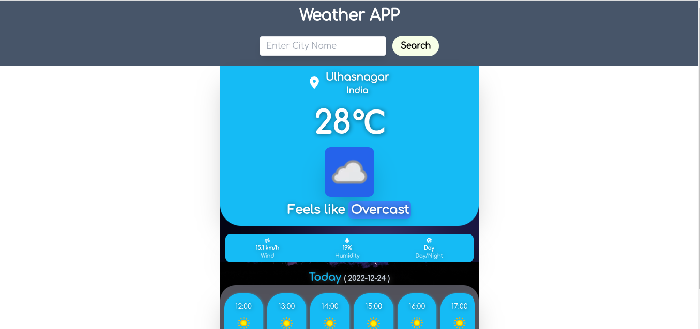
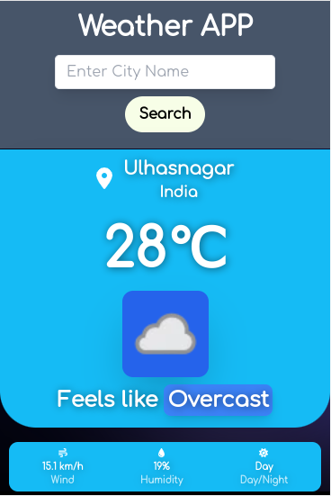

# Installation

### Clone the repository

Run the following command to clone the repository

`git clone https://github.com/alokyadav1/weather-app-react.git`

---

Go Inside the `weather-app-react` folder and install the required packages

```
 cd weather-app-react
 npm install
```

# Tailwindcss configuration

This web app is made using tailwindcss so you need to do some configuration.
Run the following command to generate the tailwind configuration file

`npx tailwindcss init -p`

Open the `tailwind.config.js` file and paste the following code.

```
/** @type {import('tailwindcss').Config} */
module.exports = {
  content: [
    "./src/**/*.{js,jsx,ts,tsx}",
  ],
  theme: {
    extend: {},
  },
  plugins: [],
}
```

# API configuration

Before running this app we need to do some API configuration

Go to `https://www.weatherapi.com/` and generate an API key for your application.
copy the generated API key and paste it in `Apikey` variable which is under `App.js` file

# Run App

Run the app using the following command
`npm run start`

# Screeenshot



# Live Preview
You can check the live preview of the app on the following link
`https://weather-app-b29a2.web.app/`
